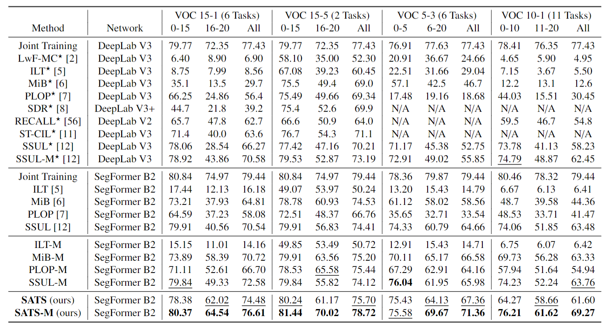
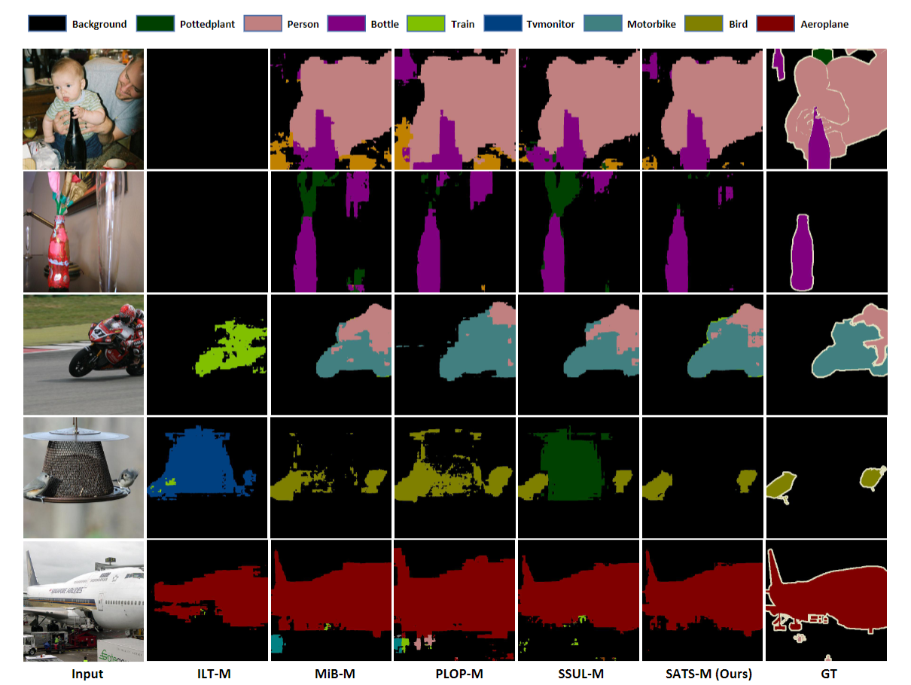

<div align="center">

# Self-Attention Transfer for Continual Semantic Segmentation

[](https://arxiv.org/abs/2203.07667)
[](https://www.sciencedirect.com/science/article/abs/pii/S0031320323000845)
</div>

SATS: Self-Attention Transfer for Continual Semantic Segmentation is a new SOTA method of Continual Semantic Segmentation, 
which utilize the unique intra-class and inter-class relationship information in advanced Transformer segmentation model.

Our SATS has been published in Pattern Recognition Journal, if you have used or mentioned SATS method, code, and other relevant contents in SATS,
please remember to cite SATS.

```
@article{QIU2023109383,
title = {SATS: Self-Attention Transfer for Continual Semantic Segmentation},
journal = {Pattern Recognition},
pages = {109383},
year = {2023},
volume = {138},
issn = {0031-3203},
doi = {https://doi.org/10.1016/j.patcog.2023.109383},
url = {https://www.sciencedirect.com/science/article/pii/S0031320323000845},
author = {Yiqiao Qiu and Yixing Shen and Zhuohao Sun and Yanchong Zheng and Xiaobin Chang and Weishi Zheng and Ruixuan Wang},
keywords = {Continual learning, Semantic segmentation, Self-attention transfer, Class-specific region pooling},
}
``` 






This repository contains all of our code. It is a modified version of [Douillard et al.'s repository](https://github.com/arthurdouillard/CVPR2021_PLOP).

[](https://paperswithcode.com/sota/overlapped-10-1-on-pascal-voc-2012?p=sats-self-attention-transfer-for-continual)
[](https://paperswithcode.com/sota/overlapped-5-3-on-pascal-voc-2012?p=sats-self-attention-transfer-for-continual)
[](https://paperswithcode.com/sota/overlapped-15-1-on-pascal-voc-2012?p=sats-self-attention-transfer-for-continual)
[](https://paperswithcode.com/sota/overlapped-15-5-on-pascal-voc-2012?p=sats-self-attention-transfer-for-continual)

[](https://paperswithcode.com/sota/overlapped-100-10-on-ade20k?p=sats-self-attention-transfer-for-continual)
[](https://paperswithcode.com/sota/overlapped-25-25-on-ade20k?p=sats-self-attention-transfer-for-continual)

# Requirements

You need to at least install the following libraries:
- Python (3.7)
- Pytorch (1.8.1+cu102)
- torchvision (0.9.1+cu102)
- tensorboardX (1.8)
- apex (0.1)
- matplotlib (3.3.1)
- numpy (1.17.2)
- mmcv
- timm
- MulticoreTSNE
- einops

When you need to set up environment in a new machine, you can use my script file: utils.txt to build up basic environment
```
bash utils.sh
```

complete library used can be found in requirements.txt

Note also that apex seems to only work with some CUDA versions, therefore try to install Pytorch (and torchvision) with
the 10.2 CUDA version. You'll probably need anaconda instead of pip in that case, sorry! Do:

```
conda install -y pytorch torchvision cudatoolkit=10.2 -c pytorch
cd apex
pip3 install -v --no-cache-dir --global-option="--cpp_ext" --global-option="--cuda_ext" ./
```

Note that while the code should be runnable without mixed precision (apex), some have reported lower perfs and slower training speed without it. So try with it!

# How to perform training
The most important file is run.py, that is in charge to start the training or test procedure.
To run it, simply use the following command:

> python -m torch.distributed.launch --nproc_per_node=\<num_GPUs\> run.py --data_root \<data_folder\> --name \<exp_name\> .. other args ..

There are many options (you can see them all by using --help option), but we arranged the code to being straightforward to test the reported methods.
Leaving all the default parameters, you can replicate the experiments by setting the following options.
- please specify the data folder using: --data_root \<data_root\>
- dataset: --dataset voc (Pascal-VOC 2012) | ade (ADE20K)
- task: --task \<task\>, where tasks are
    - 15-5, 15-5s, 19-1 (VOC), 100-10, 25-25, 100-50, 50 (ADE)
- step (each step is run separately): --step \<N\>, where N is the step number, starting from 0
- disjoint is default setup, to enable overlapped: --overlapped (all experiments in SATS are in overlapped)
- learning rate: --lr 0.01 (for step 0) | 0.001 (for step > 0)
- batch size: --batch_size \<24/num_GPUs\>
- epochs: --epochs 30 (Pascal-VOC 2012) | 60 (ADE20K)
- method: --method \<method name\>, where names are
    - FT, LWF, LWF-MC, ILT, EWC, RW, PI, MIB, PLOP, SSUL, SATS

For all details please follow the information provided using the help option.

You can use one of the provided script that will launch every step of a continual training, 
for all appeared experiments in SATS in directory: `scripts/voc` or `scripts/ade`

do
````
bash scripts/voc/sats_segformer_15-1.sh
````

In these scripts, I have commented the first line of the training command line, because all continual learning methods
share the same initially trained models (in case the hyper-parameters are the same). 
If you want to modify the hyper-parameters and retrain the first step of the continual learning, 
just cancal the comment of that command line.

Once you trained the model, you can see the result on tensorboard (we perform the test after the whole training)
 or you can test it by using the same script and parameters but using the command
> --test

that will skip all the training procedure and test the model on test data, remember to add the 
> --ckpt /path/to/model/checkpoint/files

Note that you will need to modify those scripts to include the path of checkpoint/data/pretrained dirs.

There are some intermediate directorys stored useful consistent data will be generated when run the training for the first time.
Like the `plop_median`, which stores the median value of the pseudo labels in PLOP,
`balance_step_exemplar` stores the reimplemented SSUL exemplar image indexes of a dataset,
`data` stores the overlapped separated voc/ade dataset image indexes of a dataset.
